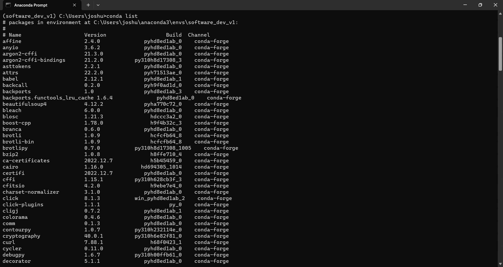

# A2: Conda Environment 

## Environment Download
Manually downloaded the environments; [software_dev_v1.yml](software_dev_v1.yml) and [software_dev_v2.yml](software_dev_v2.yml) into my `~\GitHub\PLUS_softwaredev_2025_joshua\A2` folder.

## Environment Installation #1
Succesfully installed the first environment using `conda env create -f software_dev_v1.yml` prompt.

And successfully activated the recreated environment using `conda activate software_dev_v1` prompt.

Checked the packages inside the first environment using `conda list` prompt while being inside the environment.

**Note:** _The screenshot only show a few, out of all the packages inside the environment_

## Environment Installation #2
Succesfully installed the second environment using the similar prompt as before; `conda env create -f software_dev_v2.yml`.

Successfully activated the recreated environment using `conda activate software_dev_v2` prompt.

Also checked the packages inside the second environment using `conda list` prompt while being inside the environment.

**Note:** _The screenshot only show a few, out of all the packages inside the environment_
